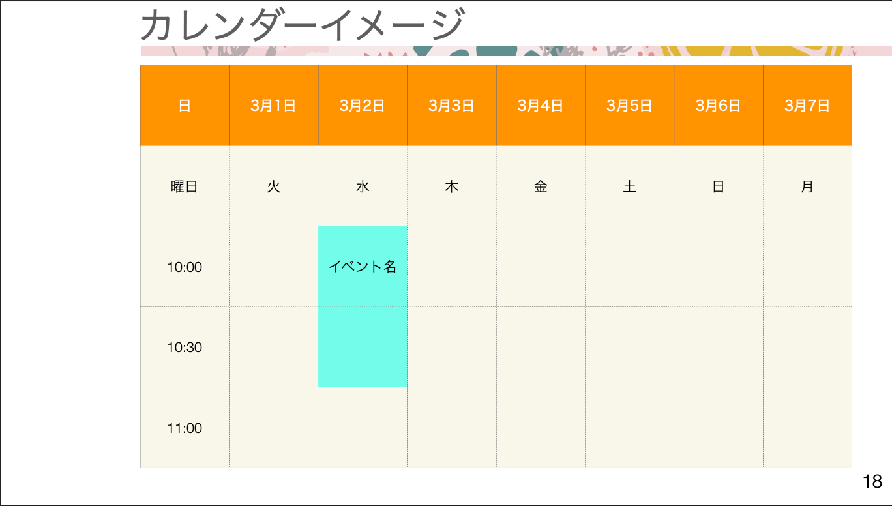

# 87. 予約カレンダーの準備

<p align="center"><a href="https://laravel.com" target="_blank"></a></p>
``` php

レイアウトを作成

resources/layouts
app.blade.phpをコピーして
calendar.blade.phpを作成
ナビゲーションなどを削除
{{ mix(‘js/flatpickr.js ’)}} を追加

View/Components 作成

app/View/Components/
App.Layout.phpをコピーしCalendar.Layout.phpを作成
public function render()
{
return view('layouts.calendar');
}
※Bladeコンポーネント機能。
詳しくは第２弾講座を参照ください。

View/Components 作成

resources/views/calendar.blade.php
manager/events/create.blade.phpなどをコピー
<x-calendar-layout>
<x-slot name=“header”>
</x-slot>
こっちにmainが入ってくる
</x-calendar-layout>

```

# 94. Bladeコンポーネント

``` php

カレンダー幅を固定

resources/css/app.css
.event-calendar{ width: 1000px; }

views/calendar.blade.php
<div class="py-4">
<div class="event-calendar border border-red-400 mx-auto sm:px-6 lg:px-8">
<div class="bg-white overflow-hidden shadow-xl sm:rounded-lg">
@livewire('calendar')
</div>
</div>
</div>

livewire/calendar.blade.php

<div class="text-center text-sm">
日付を選択してください。本日から最大30日先まで選択可能です。
</div>
<input id="calendar" class="block mt-1 mb-2 mx-auto” type="text" 略/>
<div class="flex border border-green-400 mx-auto">
<x-calendar-time /> <!̶ コンポーネント作成 仮で直書き̶>
<x-day />
<x-day />
<x-day />
<x-day />
<x-day />
<x-day />
<x-day />
</div>

componentsファイル

components/calendar-title.blade.php
<div>
<div class="py-1 px-2 border border-gray-200 text-center">日</div>
<div class="py-1 px-2 border border-gray-200 text-center">曜日</div>
<div class="py-1 px-2 h-8 border border-gray-200">10:00</div>
<div class="py-1 px-2 h-8 border border-gray-200”>10:30</div>
・・・～20時まで
</div>
components/calendar-title.blade.php
calendar-title.blade.phpをコピーし幅調整
<div class=“w-32”>
・・
</div>
繰り返し処理
25
日 3月1日 3月2日 3月3日 3月4日 3月5日 3月6日 3月7日
曜日 火 水 木 金 土 日 月
10:00 イベント名
10:30
11:00
for($i = 0; $i < 7; $i++)
for($j = 0; $j < 21; $j++)

```

# 95. 判定用データ用意

``` php

時間を定数でつくる

判定は 2022-03-01 10:00:00 の形式
app/Constants/EventConst.php
<?php
namespace App\Constants;
class EventConst
{
const EVENT_TIME = [
'10:00:00',
'10:30:00',
'11:00:00',
～20:00:00 まで ];}

エイリアスに設定

config/app.php
'aliases' => Facade:defaultAliases()->merge([
'Constant' => App\Constants\EventConst:class,
])->toArray(),
\Constant:EVENT_TIME[0] などで使えるようになる

app/Livewire/Calendar.php

public $checkDay; // 日付判定用
public $dayOfWeek; // 曜日
for($i = 0; $i < 7; $i++ )
{
$this->day = CarbonImmutable:today()->addDays($i)->format('m月d日');
$this->checkDay = CarbonImmutable::today()->addDays($i)->format('Y-m-d');
$this->dayOfWeek = CarbonImmutable::today()->addDays($i)->dayName;
array_push($this->currentWeek, [ // 連想配列に変更
'day' => $this->day, // カレンダー表示用 (○月△日)
'checkDay' => $this->checkDay, // 判定用 (○○○○-△△-□□)
'dayOfWeek' => $this->dayOfWeek // 曜日
]);
// dd($this->currentWeek )
}
```

